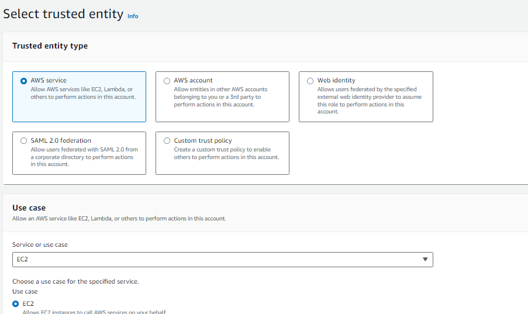
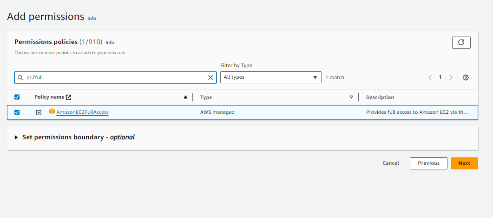
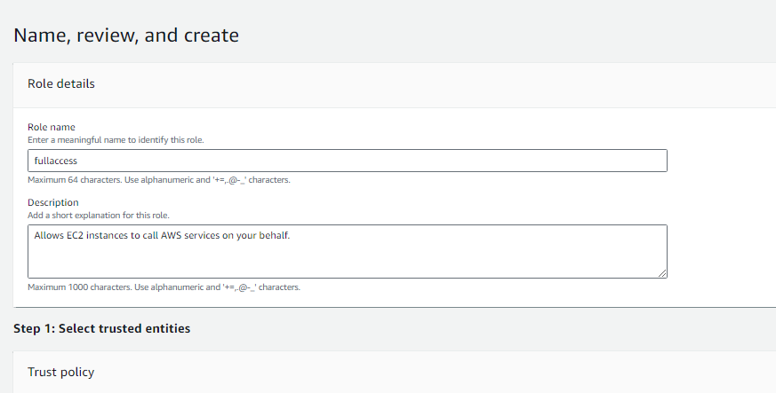
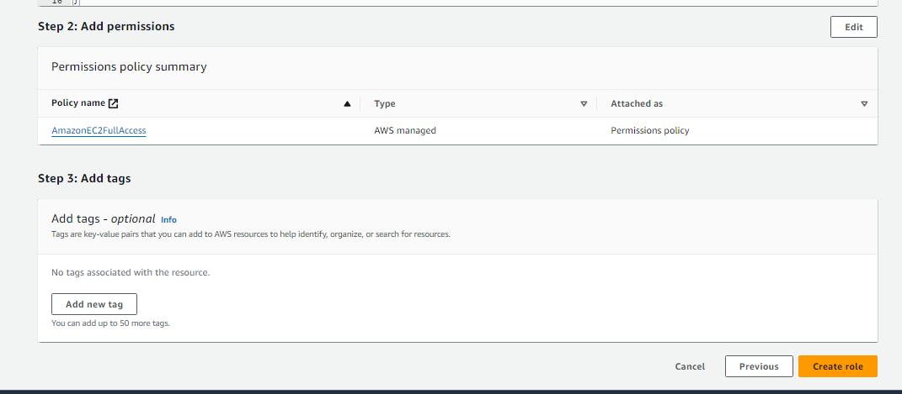

[Previious: 1. DataBase Creation](rds.md)

## 2. IAM Role Creation

1. Trusted Entity Type : AWS Service
2. Use Case : EC2

3. Permissions policies: AmazonEC2FullAccess
   
 
  
  
   
4. Role Name : fullaccess
 

Click **Create Role**.

[Next: 3. EC2 Instance Creation](ec2.md)