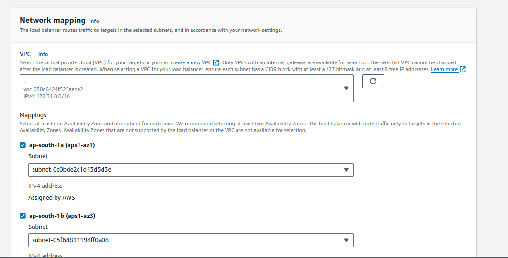
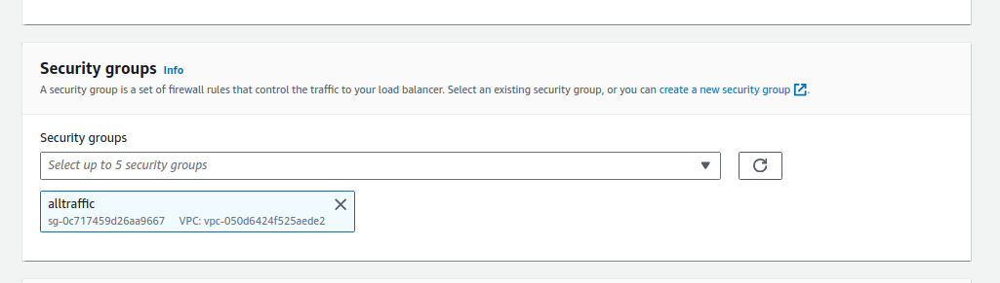
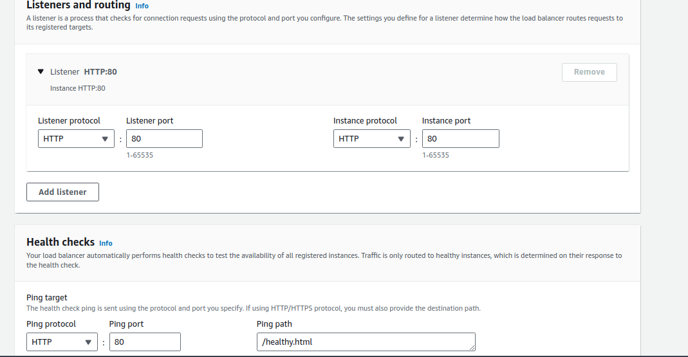
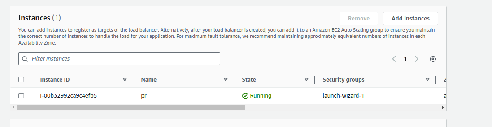

[Previous: 4. WordPress Configuration](wp.md)

## 5. Create Classic Load Balancer

1. Give Load Balancer Name

2. Select **VPC and AZ** 

3. Choose **alltraffic** Security Group 

4. Change health check html file name as **healthy.html**

5. Add **pr** instance

Similarly, Create another Classic Load Balancer for **dr** instance

[Next: 6. Route53 Setup](r53.md)