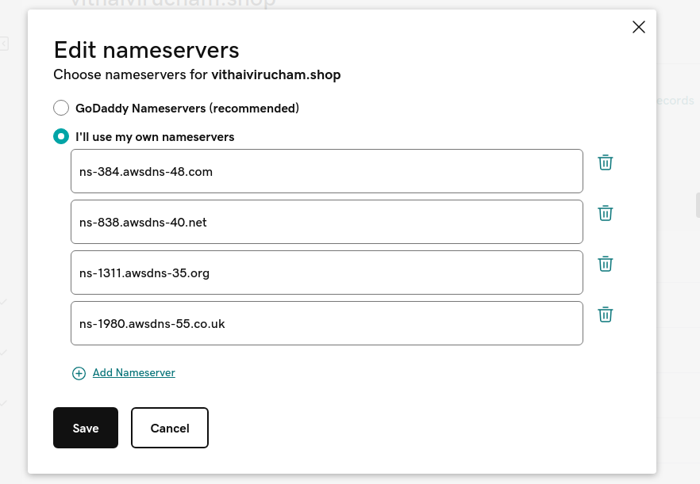

[Next: 5. Load Balancer Creation](r53.md)

## 6. AWS ROUTE53 SETUP & LINK TO GODADDY DOMAIN

Route53 Setup

Create Hosted Zone,

1. Domain Name : vithaivirucham.shop

2. Type : public hosted zone

Click **Create Hosted Zone** .

#### LINK TO GODADDY DOMAIN

Copy and paste AWS NameServers In Godaddy,

GoDaddy.com->Domains->Manage DNS -> Edit NameServers,

Save it.

#### Connect ELB with R53
1. Click Create Record.

2. Enable Alias, and choose
   Alias to Application and Classic Load Balancer
   Region
   pr Load Balancer

3. Routing Policy : Simple
   Evaluate Target : Enabled

4. Record Name : dr
   Enable Alias, and choose
   Alias to Application and Classic Load Balancer
   Region
   dr Load Balancer
5. Routing Policy : Simple
   Evaluate Target : Enabled

#### vithaivirucham.shop

#### dr.vithaivirucham.shop

[Next: 7. Server Synchronization ](sync.md)