[Previous: Introduction About Architecture](readme.md)

## 1. DataBase Creation

#### 1. Create DataBase Subnet Group

1. Give Subnet Name and Description
2. Choose VPC.

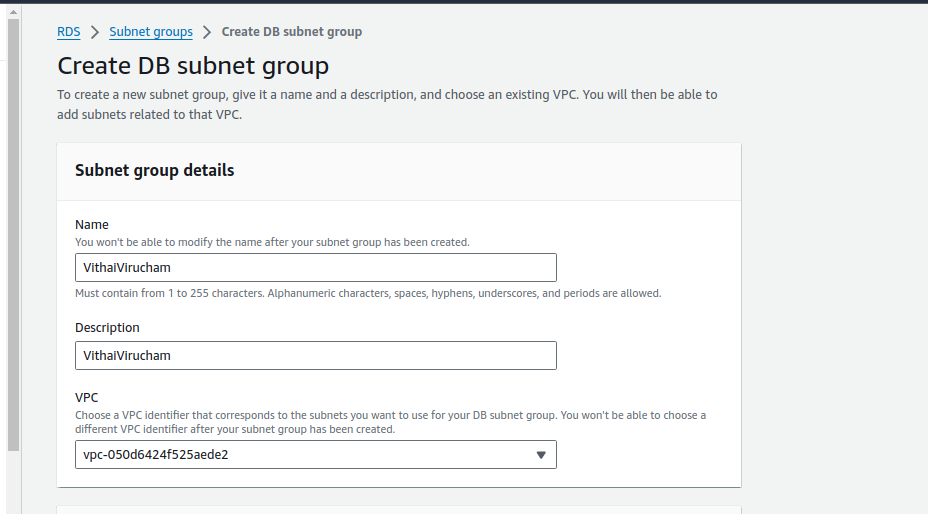

3. Choose Availability Zones and Subnets

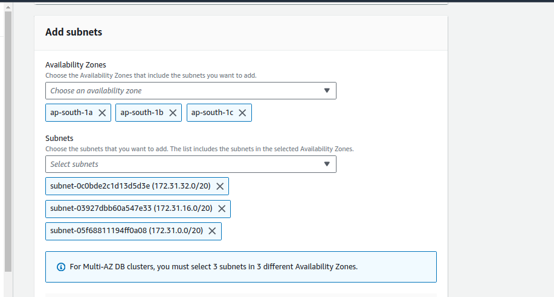
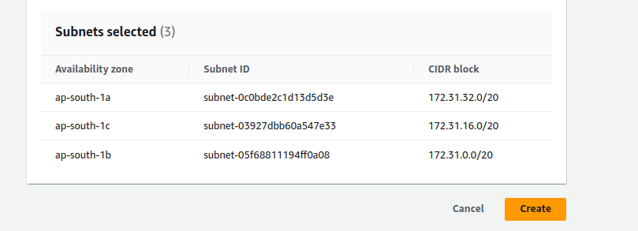

Click **Create**

#### 2. Create DataBase
Create Two DataBase one for production server and another for disaster recovery server

#### For Production Server:
   Goto **RDS**, Click Create DataBase.

1. Creation Method – Standard

2. Choose DataBase Engine - MySQL

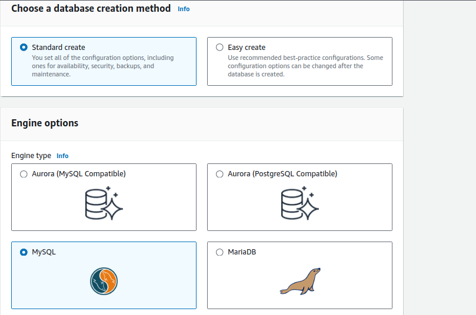

3. Choose Engine Version

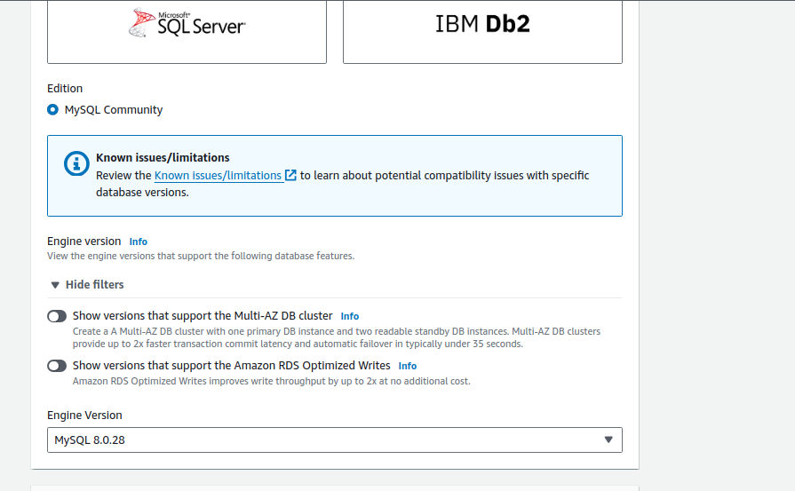

4. Template – Free Tier

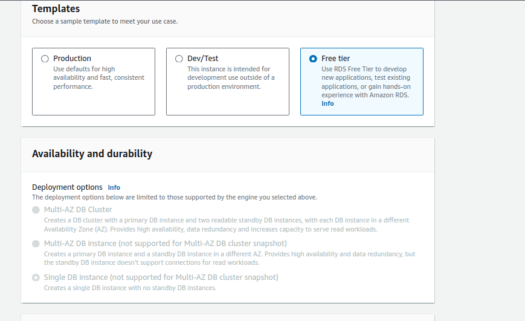

5. DB Instance Identifier - prdb

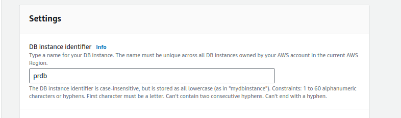

6. Credentials,
 	Master UserName : pradmin
	Password	         : prdb1234

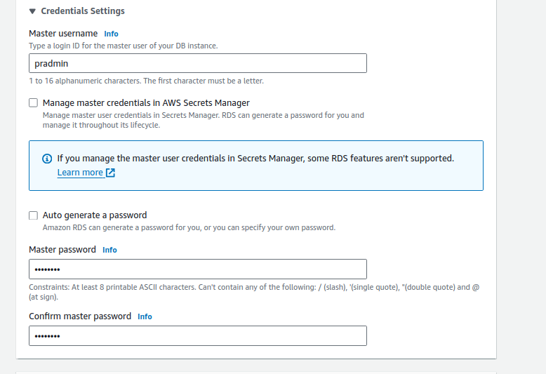

7. Choose Instance configuration,

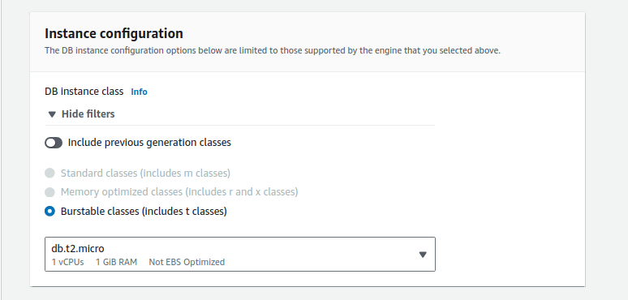

8. Enable Storage AutoScaling,

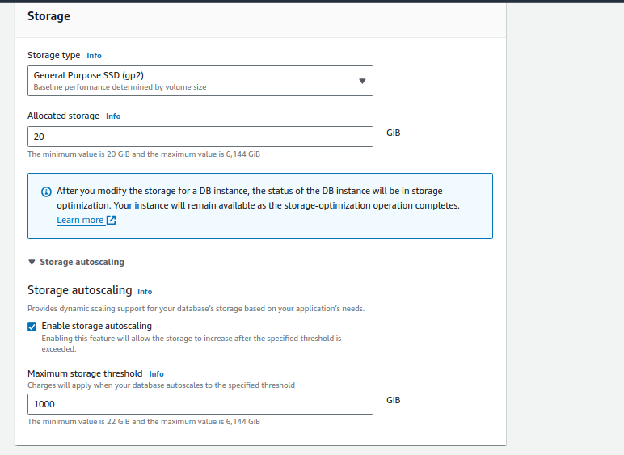

9. Choose VPC, DB Subnet Group.

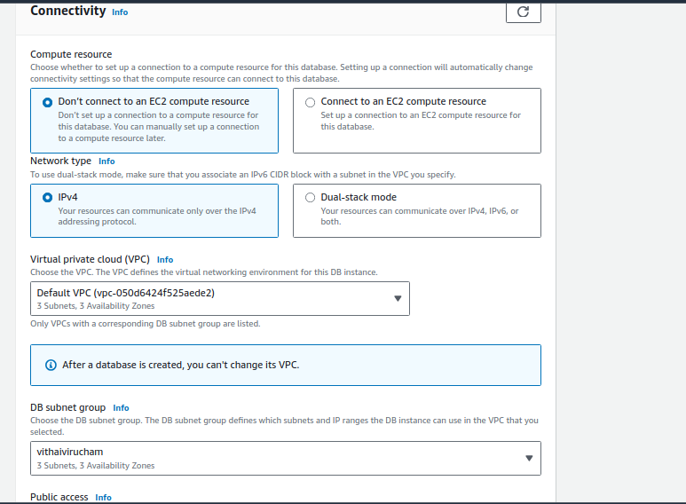

10. Public Access : No
    VPC Security Group : **alltraffic**
    Others Kept as defaults.

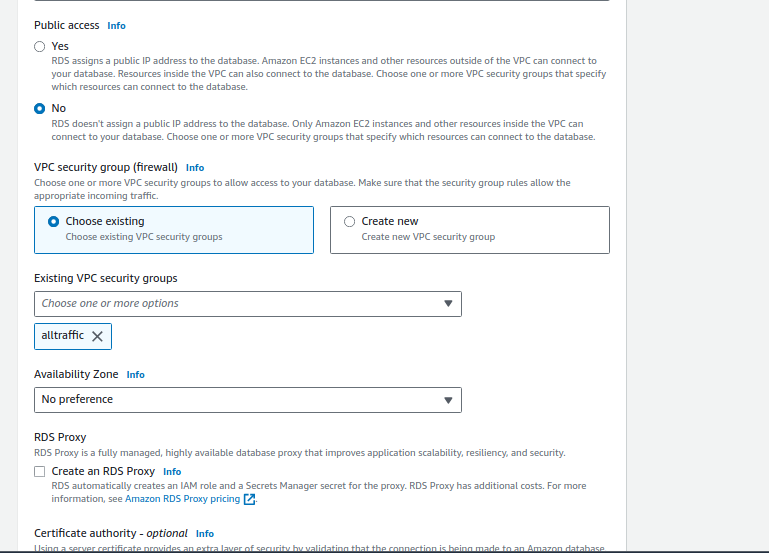
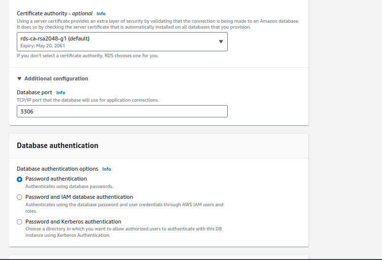

11. Additional configuration
    initial database name : prdb

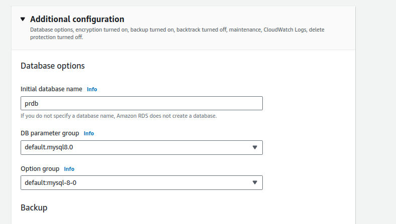
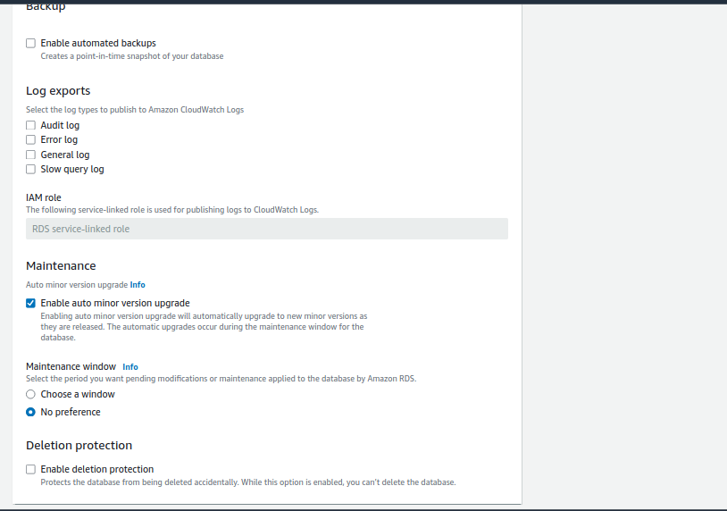

Click **Create** .

#### For Disaster Recovery

1. **Settings**

   DB instance identifier - drdb

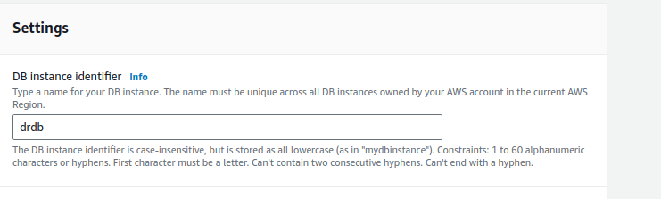

2. Credential settings,
	Master UserName : dradmin
	password	       : drdb1234

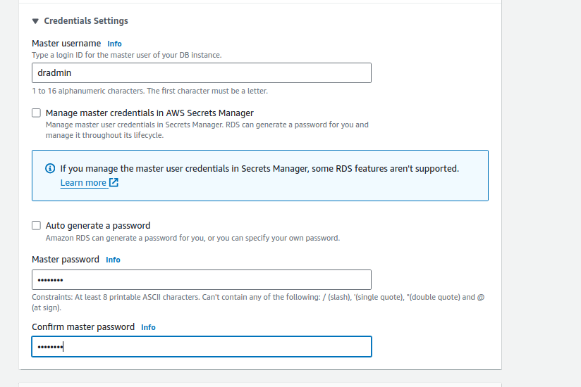

3. Initial DatabaseName : drdb

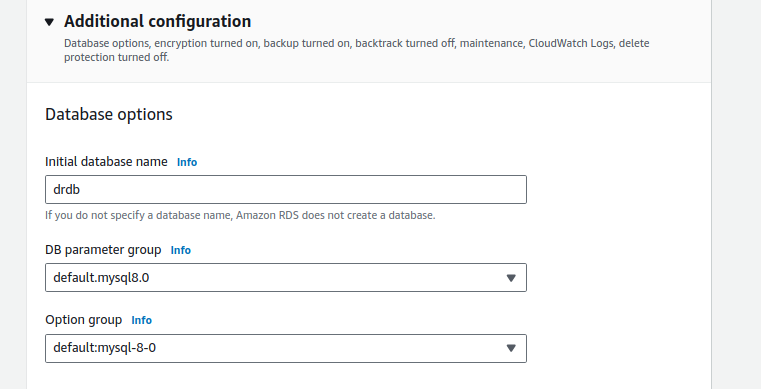

Others same as production.

[Next: 2. IAM Role Creation](iam.md)