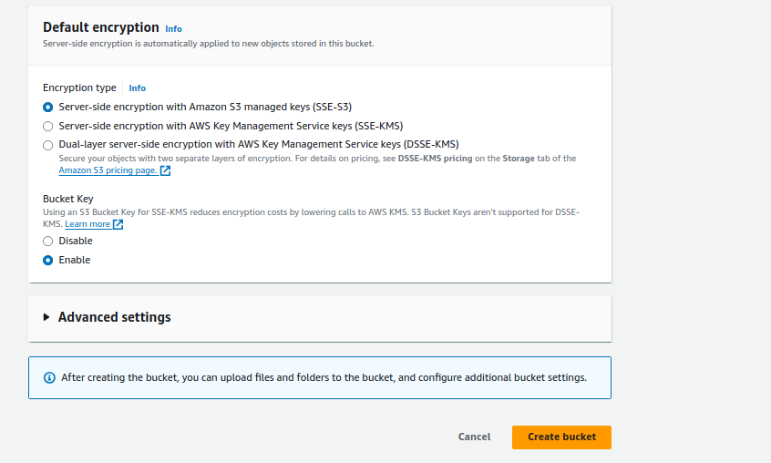
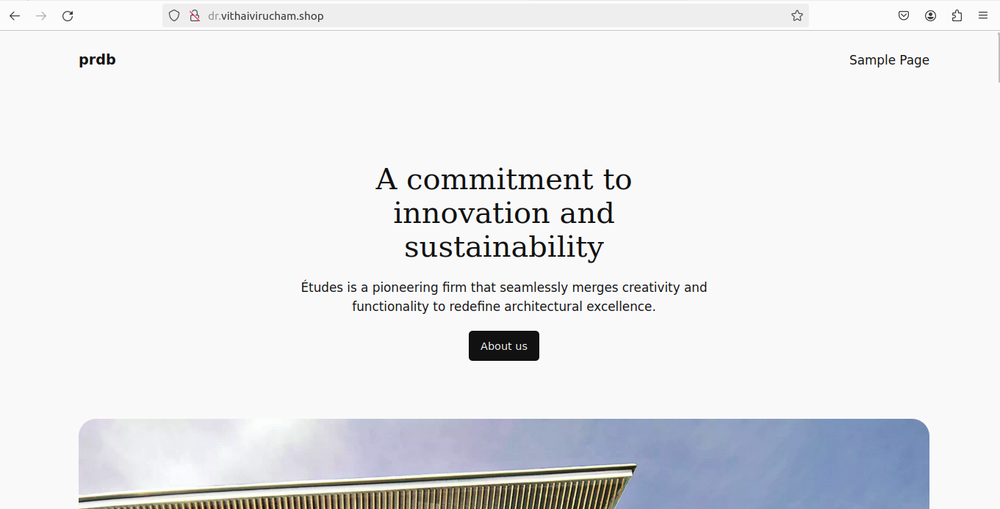

[Next: 6. Route53 Setup ](r53.md)

##  7. Server Synchronization

#### Create S3

1. Provide Bucket Name,

2. Enable **Public Access**

Click **Create Bucket**

#### Create Cronjob to synchronize Servers and S3

In **Pr** Instance,

*/2  * * * * aws s3 sync --delete /var/www/html/ s3://nkbuck

In **Dr** Instance,

*/2  * * * * aws s3 sync --delete s3://nkbuck /var/www/html/

dr.vithaivirucham.shop

