[Previous: 3. EC2 Instance Creation](ec2.md)
## 4. WordPress Configuration

##### Production Server
Ping production machine public ip in browser.
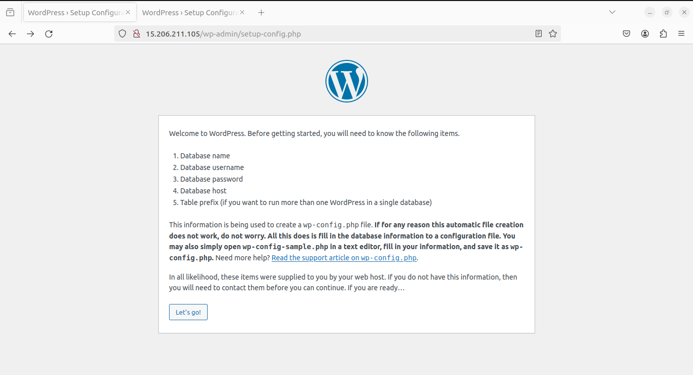

##### Disaster Server
Ping disaster recovery machine public ip in browser.
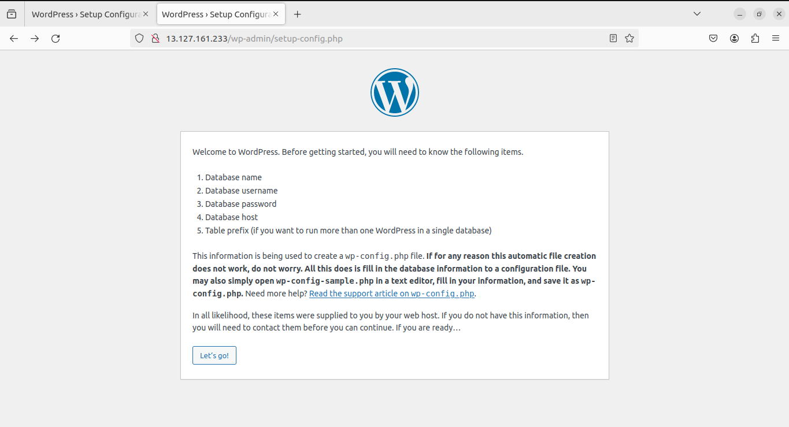

Provide production DB details

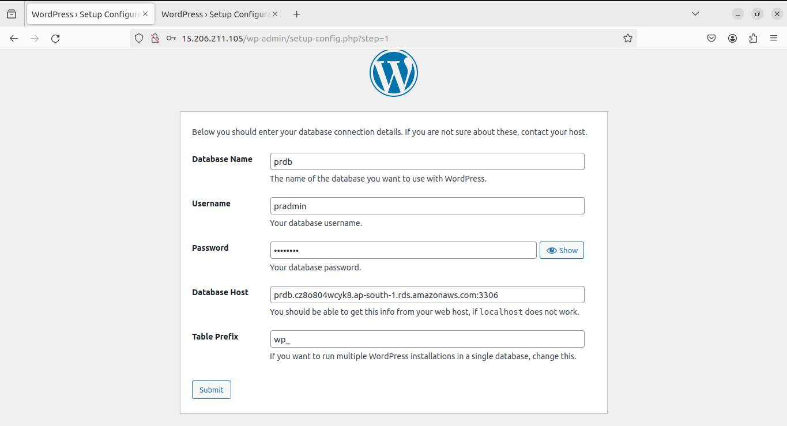

Provide disaster DB details

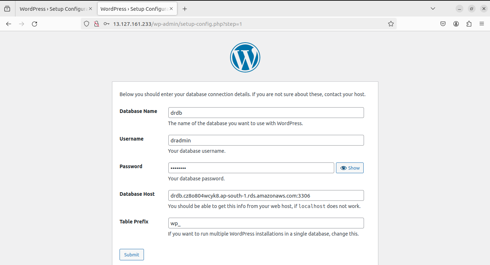

Copy the **php script** and write it to on both linux server like vi **wp-config.php**

 In word press installed path cd **/var/www/html/**

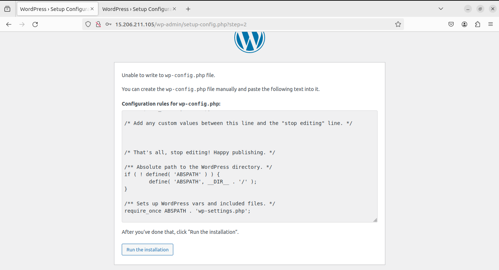

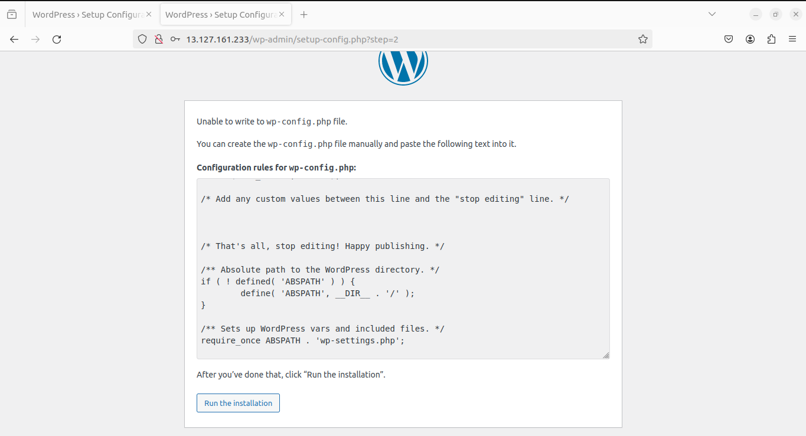

click **Submit** .

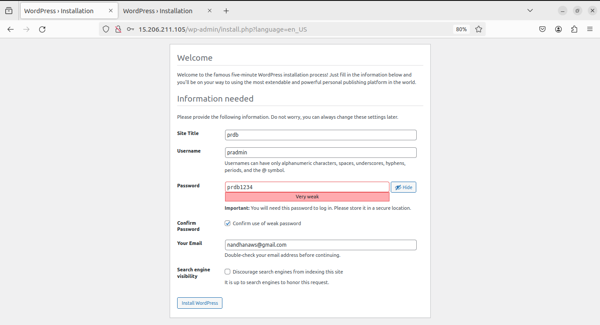

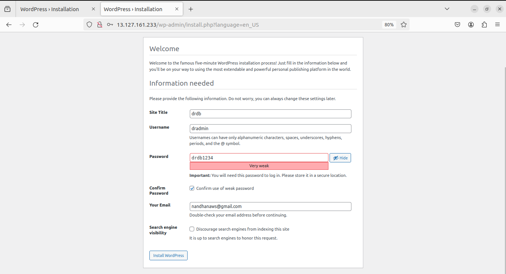

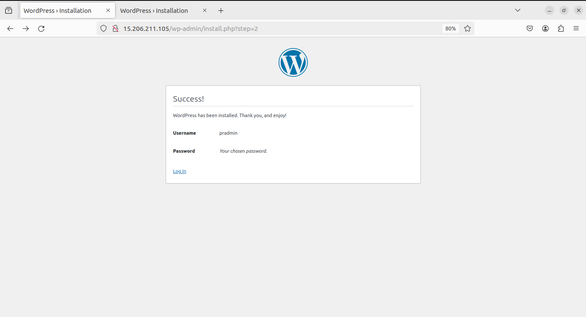

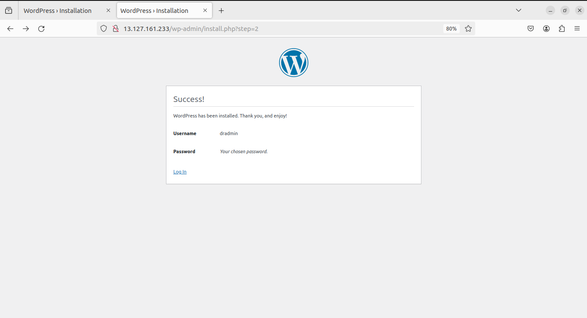

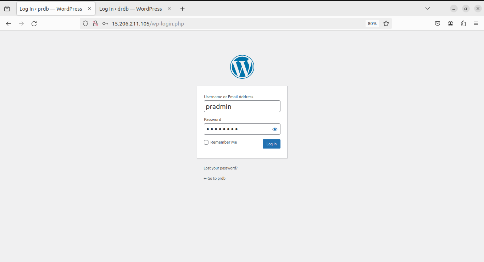

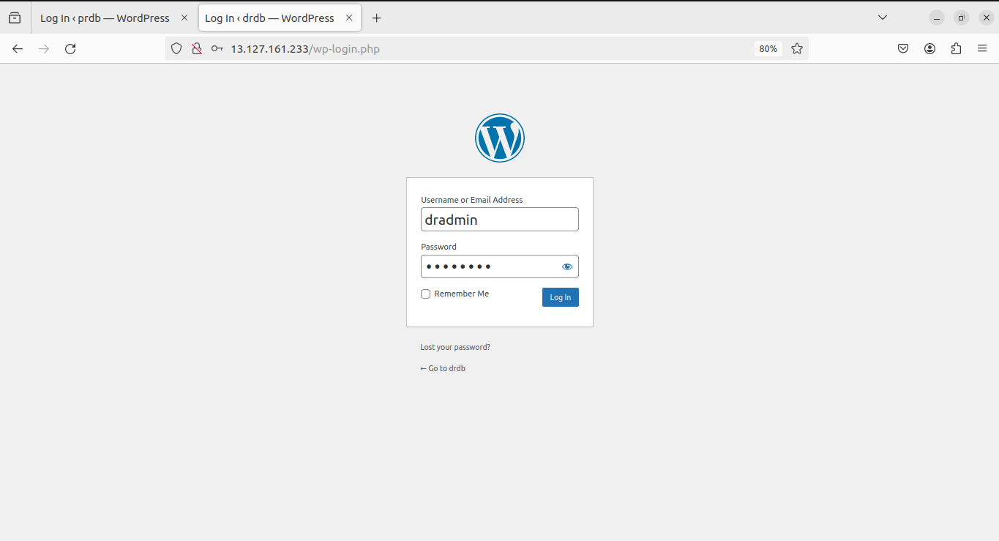

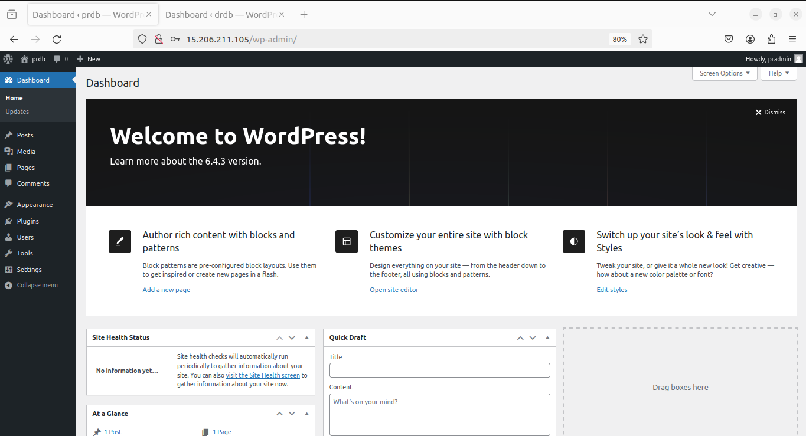

[Next: 5. Load Balancer Creation](lb.md)